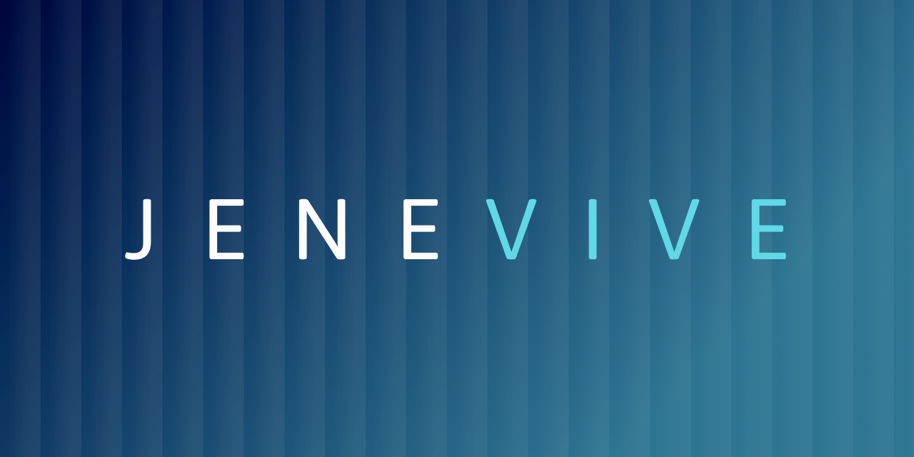

# Jenevive Health

## Overview

Jenevive Health's new responsive website showcases their latest innovation in health management. Designed for seamless browsing across devices, the site highlights the features of their cutting-edge app, helping users take control of their wellness journey with ease and confidence. For portfolio purposes, the colour scheme and content have been modified from the original version to respect client privacy.

---

## Development

### 1. Create

This project was created using by running the following in the project (`axon`) directory:

```bash
npm create vite@latest .
```

Choose Vanilla JS.

---


### 2. Install

To install dependencies, rub the following tn the project (`axon`) directory:

```bash
npm install --save-dev sass
npm install @phosphor-icons/web
npm install
```

---


### 3. Run

Run the following tn the project (`axon`) directory:

```bash
npm start
```

---


#### Design + Code + Demo

##### Figma Design
https://www.figma.com/design/vT2vGIslxd1zPkihcnFvUY/jenevive.health-2025-DEMO

##### Github Repository
https://github.com/mranenko/jenevive.health

##### Website Demo
https://jenevive.netlify.app
